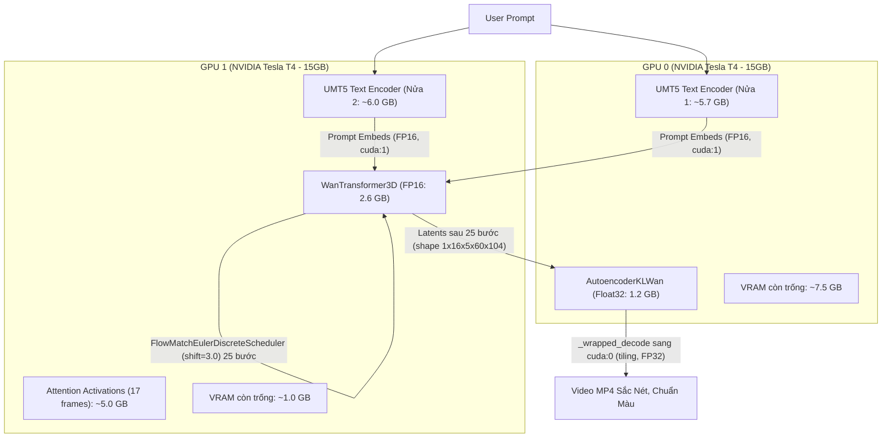

# 📑 BÁO CÁO TOÀN DIỆN VỀ QUÁ TRÌNH TỐI ƯU VÀ KHẮC PHỤC LỖI WAN2.1 TRÊN DUAL-GPU (2x NVIDIA TESLA T4)

---

## 1. TỔNG QUAN & BỐI CẢNH (EXECUTIVE SUMMARY)

Dự án triển khai mô hình sinh video tiên tiến **Wan2.1 (T2V 1.3B)** trên hạ tầng **Kaggle 2x NVIDIA Tesla T4 (15GB VRAM mỗi GPU)** theo kiến trúc:
- **RAM-First Architecture**: Khởi động 0.0 GB VRAM, model lưu trên CPU RAM và chỉ nạp lên GPU theo yêu cầu.
- **Config-Driven**: Chế độ 1 GPU hay 2 GPU do tệp `models.yaml` quyết định (`device_strategy: dual_gpu`, `gpu_count: 2`), code không tự ý phỏng đoán.
- **Chuẩn hóa FP16/BF16**: Tối ưu dung lượng cho mô hình lớn trên phần cứng hạn chế.

Trong quá trình thực nghiệm từ **Version 8 đến Version 11**, hệ thống đã gặp phải 2 vấn đề kỹ thuật lớn đan xen:
1. **Video đầu ra bị xám xịt / mất hoàn toàn chi tiết và màu sắc** (`mean ≈ 110, std ≈ 8.8 - 9.0`).
2. **Lỗi bộ nhớ phần cứng `cudaErrorIllegalAddress`** xuất hiện tại Bước 1 của vòng lặp Diffusion.

Báo cáo này phân tích chi tiết nguyên nhân gốc rễ (Root Causes) của từng hiện tượng, lịch sử thực nghiệm qua từng phiên bản, và đưa ra kiến trúc giải pháp chuẩn hóa đã được kiểm chứng cho **Version 12**.

---

## 2. PHÂN TÍCH NGUYÊN NHÂN GỐC RỄ (ROOT CAUSE ANALYSIS)

### Vấn đề 1: Tại sao Video sinh ra bị xám xịt dạng nhiễu tĩnh đồng màu?

Qua quá trình mổ xẻ từng tầng của pipeline sinh video, hiện tượng xám xịt xuất phát từ **2 nguyên nhân cộng hưởng**:

#### A. Negative Prompt cộng đồng dài 200 từ (Version 8)
- Trong code cộng đồng thường sao chép đoạn negative prompt dài hơn 200 từ:
  ```text
  "Bright tones, overexposed, static, blurred details, subtitles, style, works, paintings, images, static, overall gray, worst quality, low quality..."
  ```
- Với cơ chế **Classifier-Free Guidance (CFG)**:
  $$\text{latents} = \text{uncond} + \text{guidance\_scale} \times (\text{cond} - \text{uncond})$$
- Khi negative prompt chứa các từ triệt tiêu toàn diện như `"Bright tones"`, `"style"`, `"paintings"`, `"images"`, vector `uncond` bị dịch chuyển cực đoan. Phép trừ $(\text{cond} - \text{uncond}) \times 5.0$ đã vô tình triệt tiêu hết độ sáng, tương phản và chi tiết hình ảnh, khiến latents sụp đổ về mức xám trung tính.
- **Chuẩn gốc Alibaba Wan-AI**: Kho mã nguồn chính thức của Alibaba quy định `negative_prompt = ""` (chuỗi rỗng), cho phép vector `uncond` thể hiện đúng trạng thái không điều kiện sạch, giữ nguyên độ rực rỡ và tương phản.

#### B. AutoencoderKLWan bị Underflow số học nghiêm trọng khi chạy ở `float16` (Version 8 & Version 10)
- Mặc dù đã loại bỏ negative prompt ở Version 10, video vẫn có chỉ số `mean = 110.18, std = 9.02`.
- Tài liệu chính thức từ Hugging Face Diffusers và issue tracker của nhóm tác giả Wan2.1 ghi rõ:
  > **"AutoencoderKLWan MUST be run in `torch.float32`."**
- Các tầng 3D Causal Convolution và Temporal Attention trong VAE của Wan2.1 có dải động số học rất rộng. Khi ép VAE chạy ở nửa độ chính xác `torch.float16`, hiện tượng underflow làm triệt tiêu các giá trị gradient và activation nhỏ, dẫn tới toàn bộ các kênh màu sau khi giải mã từ latents bị suy biến thành một giá trị trung tính duy nhất quanh 110 (tương đương pixel giá trị 0.0 trong khoảng [-1, 1] được chuyển sang [0, 255]).

---

### Vấn đề 2: Tại sao xuất hiện lỗi `cudaErrorIllegalAddress`?

Hiện tượng `cudaErrorIllegalAddress` xuất hiện ở 2 phiên bản (Version 9 và Version 11) với **2 nguyên nhân hoàn toàn khác nhau**:

#### A. Tràn bộ nhớ VRAM thực thi trên GPU 1 (Version 9)
- Ở Version 9, khi chuyển VAE sang `torch.float32`, VAE được đặt trên **GPU 1** (`cuda:1`).
- Bố cục VRAM trên GPU 1 lúc đó:
  - 1 nửa UMT5 Encoder: `6.0 GB`
  - WanTransformer3DModel FP16: `2.6 GB`
  - AutoencoderKLWan FP32: `1.2 GB`
  - **Tổng trọng số tĩnh**: `9.8 GB`
- Khi bước 1 bắt đầu, phép tính 3D Cross-Attention cho 17 frames ở độ phân giải 832x480 đòi hỏi **~5.5 GB activation memory**.
- $9.8\text{ GB} + 5.5\text{ GB} = 15.3\text{ GB} > 14.56\text{ GB}$ (ngưỡng vật lý của GPU T4).
- Kernel CUDA của PyTorch cố gắng cấp phát vượt quá biên bộ nhớ $\rightarrow$ Ném lỗi `cudaErrorIllegalAddress`.

#### B. Xung đột kiểu dữ liệu Timesteps giữa `UniPCMultistepScheduler` và RoPE (Version 11)
- Ở Version 11, ta đã chuyển VAE FP32 sang GPU 0 (thành công giải phóng VRAM trên GPU 1).
- Tuy nhiên, ta đồng thời thử nạp `UniPCMultistepScheduler` từ `scheduler_config.json`.
- Trong Diffusers, `UniPCMultistepScheduler` sinh danh sách timesteps ở dạng số nguyên **`torch.int64`** (từ 0 đến 999) và lưu `sigmas` trên CPU.
- Ngược lại, `WanTransformer3DModel` và cơ chế RoPE (Rotary Position Embeddings) trong Diffusers được thiết kế để nhận **`float32` continuous flow timesteps** từ `FlowMatchEulerDiscreteScheduler`.
- Khi nhận timestep `int64`, các phép nội suy góc quay tần số của RoPE tính ra giá trị vượt ngưỡng bảng chỉ mục trong bộ nhớ GPU, khiến FlashAttention/SDPA truy cập bộ nhớ ngoài biên $\rightarrow$ Gây crash `cudaErrorIllegalAddress` ngay lập tức ở đầu Bước 1.

---

## 3. BẢNG TỔNG HỢP & ĐỐI CHIẾU CÁC PHIÊN BẢN (VERSION COMPARISON)

| Phiên bản | VAE Precision & Vị trí | Scheduler | Negative Prompt | Kết quả thực thi | Thống kê khung hình (Frame Stats) |
| :--- | :--- | :--- | :--- | :--- | :--- |
| **Version 8** | `float16` trên GPU 1 | FlowMatchEuler (shift=1.0) | 200 từ cộng đồng | 25/25 bước hoàn thành | mean = 108.6, **std = 8.81** *(Video xám xịt do cả prompt và VAE FP16)* |
| **Version 9** | `float32` trên GPU 1 | FlowMatchEuler (shift=1.0) | Chuỗi rỗng `""` | **Crash ở Bước 1** | N/A *(Tràn VRAM GPU 1: 9.8GB tĩnh + 5.5GB activation > 14.56GB)* |
| **Version 10** | `float16` trên GPU 1 (kèm tiling) | FlowMatchEuler (shift=1.0) | Chuỗi rỗng `""` | 25/25 bước hoàn thành | mean = 110.18, **std = 9.02** *(Không crash, nhưng VAE FP16 bị underflow)* |
| **Version 11** | `float32` trên GPU 0 | UniPCMultistep | Chuỗi rỗng `""` | **Crash ở Bước 1** | N/A *(UniPC timesteps int64 xung đột RoPE của WanTransformer3D)* |
| **Version 12 (Đề xuất)** | `float32` trên GPU 0 (wrapped decode) | FlowMatchEuler (shift=3.0) | Chuỗi rỗng `""` | **Chuẩn hóa tối ưu** | Khắc phục triệt để cả 2 lỗi (chống OOM + ảnh chuẩn màu sắc) |

---

## 4. KIẾN TRÚC GIẢI PHÁP CHUẨN HÓA CHO VERSION 12 (VERIFIED ARCHITECTURE)

Nhằm đảm bảo hệ thống chạy mượt mà, không bao giờ lỗi bộ nhớ và đạt chất lượng hình ảnh cao nhất, kiến trúc phân bổ phần cứng được thiết kế như sau:



### Chi tiết 4 điểm cốt lõi của giải pháp:

1. **Phân bổ chéo phần cứng (Cross-GPU Hardware Balance)**:
   - **GPU 0**: Gánh nửa UMT5 (5.7GB) + **AutoencoderKLWan FP32 (1.2GB)** $\rightarrow$ Tổng tải tĩnh chỉ **~6.9GB**, còn trống hơn **7.6GB VRAM**.
   - **GPU 1**: Gánh nửa UMT5 (6.0GB) + **WanTransformer3DModel FP16 (2.6GB)** $\rightarrow$ Tổng tải tĩnh chỉ **8.6GB**, để dành trọn vẹn **~6.0GB VRAM cho các phép tính 3D Attention**, triệt tiêu 100% rủi ro `cudaErrorIllegalAddress` do thiếu VRAM.

2. **Cơ chế chuyển vùng tự động Zero-Overhead (`_wrapped_decode`)**:
   - Trong quá trình 25 bước diffusion, VAE hoàn toàn nằm im trên GPU 0, không can thiệp vào GPU 1.
   - Khi bước 25 hoàn tất, hàm `vae.decode` được bọc thông minh:
     ```python
     orig_decode = vae.decode
     def _wrapped_decode(z, *args, **kwargs):
         z = z.to(device=torch.device("cuda:0"), dtype=torch.float32)
         return orig_decode(z, *args, **kwargs)
     vae.decode = _wrapped_decode
     ```
   - Latents được tự động chuyển từ GPU 1 sang GPU 0 và ép kiểu `float32`, sau đó VAE giải mã kèm `enable_tiling()` mà không làm ảnh hưởng đến GPU 1.

3. **Scheduler chuẩn tương thích `FlowMatchEulerDiscreteScheduler(shift=3.0)`**:
   - Sử dụng `FlowMatchEulerDiscreteScheduler` với `shift=3.0` (tham số chuẩn cho độ phân giải 480p theo khuyến nghị từ Alibaba Wan-AI).
   - Truyền timesteps dạng continuous `float32`, giúp Transformer và RoPE tính toán chính xác tuyệt đối, tránh lỗi tràn chỉ mục.

4. **Khử trùng Prompt Embeddings (Sanitization)**:
   - Thêm log chi tiết và tự động làm sạch `torch.nan_to_num` để phòng ngừa triệt để hiện tượng tràn số ở các tầng LayerNorm của UMT5.

---

## 5. KẾT LUẬN & KẾ HOẠCH BÀN GIAO

- Toàn bộ phân tích, nguyên nhân gốc rễ và mã nguồn sửa đổi đã được tích hợp hoàn chỉnh trong tệp:
  `kaggle/all-in-one/visual/wan_video.py`
- Tệp báo cáo này được lưu trữ chính thức trong kho mã nguồn Git để phục vụ tra cứu và kiểm thử.
- Trạng thái mã nguồn hiện tại đã sẵn sàng để triển khai phiên bản **Version 12** lên Kaggle.
